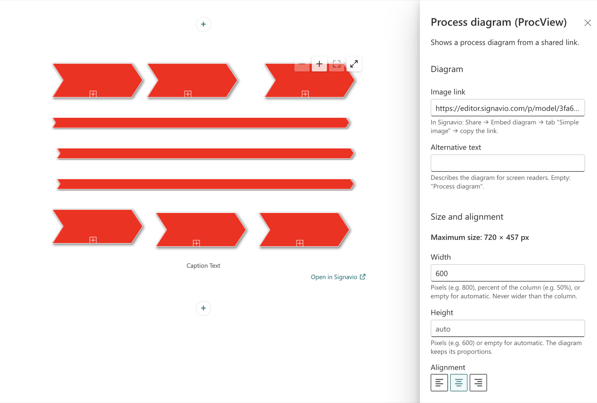
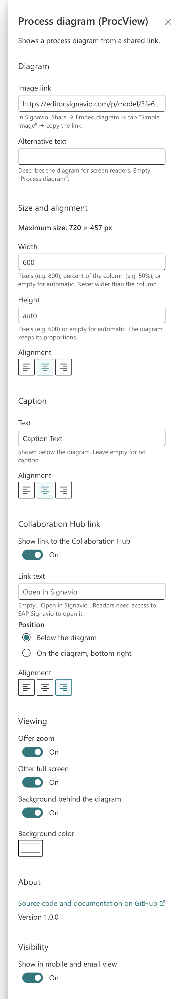
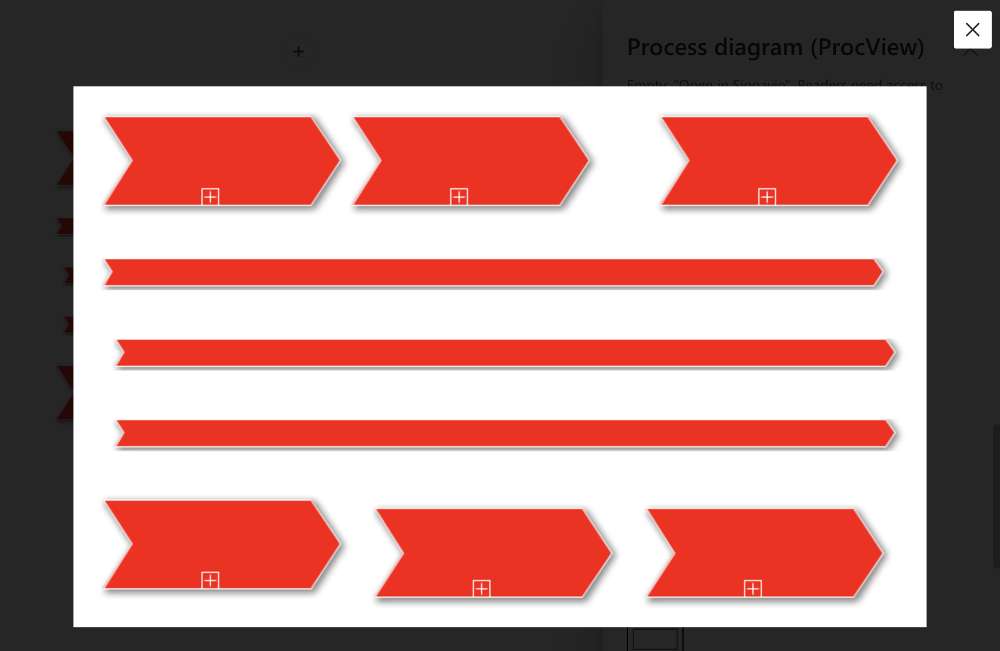
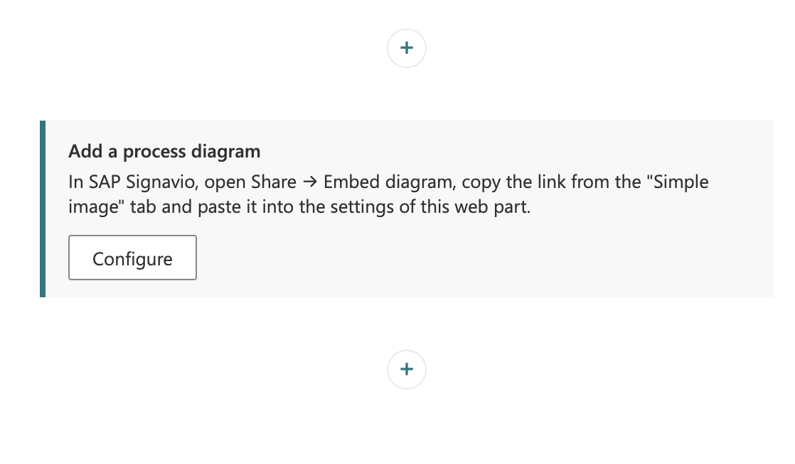
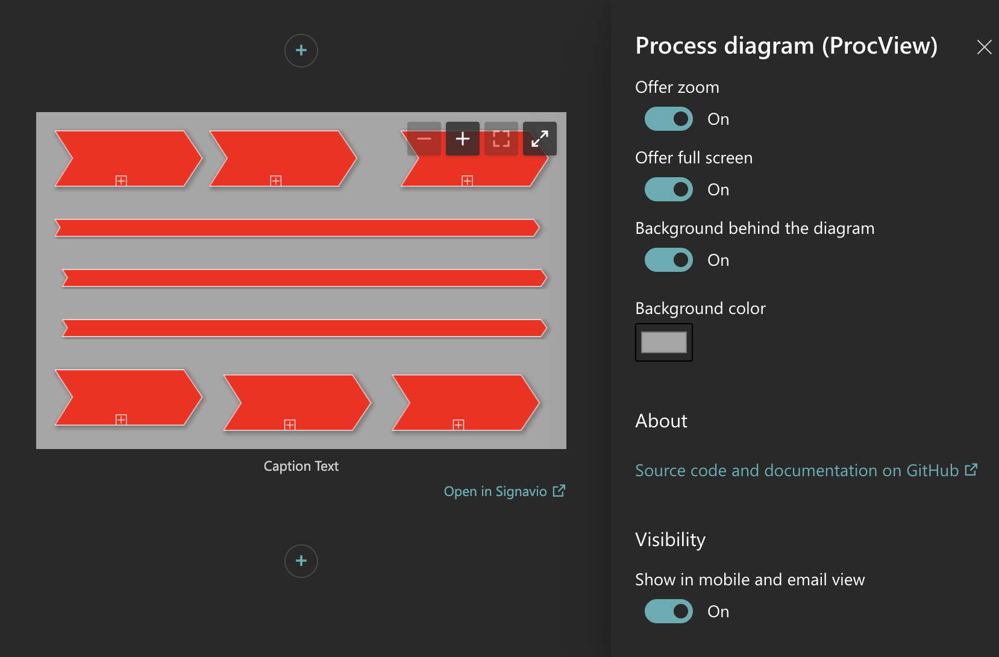
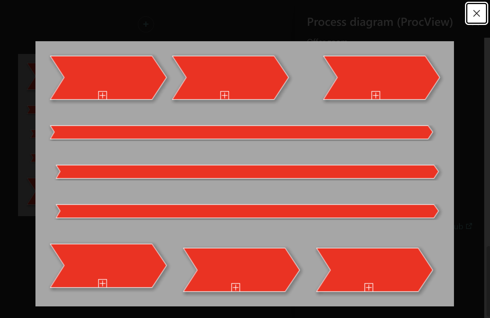

# spfx-procview

[](https://github.com/xnyzer/spfx-procview/actions/workflows/ci.yml)

SPFx web part to embed SAP Signavio process diagrams in SharePoint with adjustable size.



SharePoint's built-in embed web part only renders iframes, which leaves no way to control
how large an embedded SAP Signavio diagram appears on the page. `spfx-procview` is a
SharePoint Framework web part that takes the **"Simple image" link** of a shared Signavio
diagram and displays it directly — no iframe — at a configurable size, with an optional
caption, an optional link to the Signavio Collaboration Hub, optional zoom and a full-screen
view; it follows the page and section theme, works as a Microsoft Teams tab and speaks
English, German, French and Spanish. It is built to be deployed tenant-wide by IT and
designed so that further process tools can be supported later.

Open source under the Apache-2.0 licence, built with SharePoint Framework 1.23.2. The
screenshots come from the local workbench; on SharePoint pages the web part looks the same.

## Features at a glance

- **The diagram as an image** — no iframe, no sign-in for readers; the link shows the diagram
  as it currently is in SAP Signavio
- **Size you control** — width in pixels or percent of the column, height in pixels, or
  automatic; never wider than the column, never distorted; aligned left, centred or right
- **Caption and Collaboration Hub link** — optional text below the diagram and a link to the
  interactive diagram in SAP Signavio, below the diagram or on it
- **Zoom and full screen** — optional zoom with mouse, keyboard and touch; a full-screen view
  of the diagram alone
- **Readable everywhere** — a colour behind the transparent diagram, colours that follow the
  site and section theme, and the Teams theme in a Teams tab
- **Clear messages** — editors see what is wrong and how to fix it, readers a short note
- **Accessible and multilingual** — keyboard and screen-reader support; texts in English,
  German, French and Spanish
- **Privacy-friendly** — no cookies, no telemetry, no API of its own; image requests send no
  referrer

## Status

In development: all planned features are implemented — display and sizing, caption,
Collaboration Hub link, empty and error states, texts in English, German, French and
Spanish, theme colours per section, zoom and pan, full-screen view, a background behind the
diagram, and Microsoft Teams tabs. There is **no release yet**: the first release 1.0.0 with
versioning, CI release and an IT deployment guide (F-009) follows.
See `PROGRESS.md` for the roadmap.

## Quick start (for page editors)

1. **Get the link in SAP Signavio:** select the diagram, then **Share → Embed diagram**. If
   the options are disabled, click "Share diagram for read-only access". Copy the link from
   the **"Simple image"** tab — not the embed code.
2. **Add "Process diagram (ProcView)"** to a SharePoint page (group "Planning and process").
   Click **Configure** in the web part (or its edit button) and paste the link into
   **Diagram → Image link**. The diagram appears right away.
3. **Adjust it if needed** — alternative text, size, caption, hub link, zoom and full screen;
   see [Settings](#settings). Then republish the page.

Shared "Simple image" links are readable by anyone who has them — embed only diagrams that
are approved for that kind of sharing.

## Settings

The property pane lists the settings in the order editors work through them. Every default
also applies to web parts saved before the setting existed.

| Group | Setting | Values | Default | Notes |
|-------|---------|--------|---------|-------|
| Diagram | Image link | The "Simple image" link from SAP Signavio | — | Checked while you type; the embed code and other links are rejected with a hint (see [Messages](#messages)) |
| Diagram | Alternative text | Text | "Process diagram" | Read by screen readers instead of the image — describe what the diagram shows |
| Size and alignment | Maximum size | Information only | — | The diagram's natural size, shown once it has loaded, e.g. "Maximum size: 720 × 457 px" |
| Size and alignment | Width | Pixels (`800`), percent of the column (`50%`) or empty | Automatic | 1–10,000 pixels or 1–100 %; never wider than the column; with only a width set, the height follows the proportions |
| Size and alignment | Height | Pixels (`600`) or empty | Automatic | 1–10,000 pixels, no percent (a column has no fixed height); with a fixed height the diagram is fitted into the box, never distorted |
| Size and alignment | Alignment | Left, centre, right | Centre | Positions a diagram that is narrower than its column |
| Caption | Text | Text | Empty (no caption) | Shown below the diagram |
| Caption | Alignment | Left, centre, right | Centre | Applies to the caption only |
| Collaboration Hub link | Show link to the Collaboration Hub | On, off | Off | A link to the interactive diagram, derived from the image link; opens in a new tab. Readers need access to SAP Signavio to open it |
| Collaboration Hub link | Link text | Text | "Open in Signavio" | Shown while the link is on |
| Collaboration Hub link | Position | Below the diagram, on the diagram (bottom right) | Below the diagram | On the diagram, the link is always visible, not only on hover |
| Collaboration Hub link | Alignment | Left, centre, right | Right | Only for the position below the diagram |
| Viewing | Offer zoom | On, off | Off | Zoom controls on the diagram — see [Zoom and full screen](#zoom-and-full-screen) |
| Viewing | Offer full screen | On, off | On | A button on the diagram that opens it alone on a dark layer |
| Viewing | Background behind the diagram | On, off | On | A colour exactly behind the diagram — Signavio images are transparent and hard to read on dark or coloured sections. Applies in full screen too; switched off, the diagram stays transparent there as well |
| Viewing | Background color | The browser's colour picker | White | Shown while the background is on |
| About | Source code and documentation on GitHub | Link | — | Opens this repository; the web part's version (e.g. "Version 1.0.0") is shown below it |

Width or height larger than the maximum size enlarge the image beyond its natural size,
and it becomes blurry. The group **Visibility** ("Show in mobile and email view") at the end
of the pane belongs to SharePoint, not to this web part.

<details>
<summary>The complete property pane (example values, every option switched on)</summary>
<br>

</details>

## Zoom and full screen

Readers use these controls; editors switch them on under **Viewing**. Zoom is available
while the diagram is shown noticeably smaller than its natural size, and it stops at the
natural size, so the diagram stays sharp. The keys work while the diagram has the keyboard
focus (reach it with Tab).

| Action | Mouse | Keyboard | Touch |
|--------|-------|----------|-------|
| Zoom in, zoom out | **+** and **−** top right on the diagram; Ctrl (Cmd on a Mac) + mouse wheel | `+` (or `=`), `-` | Two-finger pinch |
| Fit to the frame | **Fit to frame** button | `0` | Pinch until the diagram fits |
| Move while zoomed in | Drag with the left mouse button | Arrow keys | Drag with one finger |
| Open full screen | **Full screen** button top right on the diagram | Tab to the button, Enter or Space | Tap the button |
| Close full screen | **Close** button top right, or a click next to the diagram | Escape | Tap **Close** or next to the diagram |

- The plain mouse wheel and one-finger swipes keep scrolling the page while the diagram is
  shown at its configured size. The zoom buttons appear only while zooming is possible.
- Full screen shows nothing but the diagram on a dark layer — at its natural size, or smaller
  to fit the window. When it had to be made smaller, it can be zoomed there too, even with
  "Offer zoom" switched off. Otherwise a pinch magnifies the page as usual.



## Messages

Editors see what is wrong and how to fix it, with a **Configure** button that opens the
settings. Readers see a short message — or nothing at all while no link is set.

| Situation | Editors see | Readers see | What to do |
|-----------|-------------|-------------|------------|
| No link yet | "Add a process diagram" with the steps in SAP Signavio, and **Configure** | Nothing — the web part stays empty | Paste the "Simple image" link |
| The link cannot be used (e.g. the embed code, an incomplete link, a link from another tool) | "This link cannot be displayed" with the reason, and **Configure** | "The diagram is currently unavailable." | Copy the link again from the "Simple image" tab in SAP Signavio |
| The image could not be loaded | "The diagram could not be loaded" with the possible causes — sharing turned off in SAP Signavio, an incomplete or outdated link, a network, firewall or proxy blocking the Signavio domain — and **Configure** | "The diagram could not be loaded." — plus the Collaboration Hub link, if it is switched on | Check the read-only sharing in SAP Signavio, copy the link again, or ask IT to allow the Signavio host (see [For IT](#for-it)) |
| A security policy of the site blocks the image | "Images from *host* are blocked" — a security policy of this site prevents loading the diagram | "The diagram could not be loaded." — plus the Collaboration Hub link, if it is switched on | Ask the SharePoint administrator to allow the domain |

A failed load counts only for the link it happened with: changing the link, or entering it
again, loads the diagram again.

The property pane also checks the fields while you type and names the problem below them:

- **Image link** — the embed code instead of the link, an image link that is not the "Simple
  image" link, a missing or invalid access key or diagram id, an address that does not start
  with `https://`, a Signavio address that is not supported, or a link from a tool other than
  SAP Signavio. Each message says what to copy instead.
- **Width and height** — anything other than pixels, a percentage (width only) or empty; more
  than 10,000 pixels; a percentage outside 1–100 %.



## Themes and accessibility

All colours follow the site theme and the section the web part sits in — also on a coloured
or dark section background (messages, the "Configure" button, links and the focus outline
take the section's colours). Everything is reachable with the keyboard with a visible focus
outline; the diagram has an alternative text (default "Process diagram"), links to Signavio
announce that they open a new tab, and Windows high-contrast mode and "reduce motion" are
respected.

<p>


</p>

## Languages

The web part shows its texts (settings, messages, toolbox entry) in the language SharePoint
uses for the page — English, German, French or Spanish; any other language falls back to
English. Instructions name the Signavio menu items as Signavio shows them in that language
(German: **Freigeben → Diagramm einbetten**, tab **"Einfaches Bild"**, taken from the German
Signavio UI). French uses the labels of the machine-translated French SAP Signavio user
guide (**Partager → Incorporer un diagramme**, tab **"Image simple"**) and Spanish the
English labels (no Spanish Signavio documentation exists) — neither is verified against the
Signavio UI. Have the French and Spanish texts reviewed by native speakers before production
use. Texts that editors enter (caption, alternative text, link text) are shown as entered —
translate them with SharePoint's multilingual pages if needed.

## Microsoft Teams

- **Where:** as a **tab in a Teams channel** — the settings appear when the tab is added. The
  web part is not offered as a personal Teams app: personal apps show no settings, so no
  diagram link could ever be entered.
- **Themes:** in Teams' dark and high-contrast themes the web part switches to matching
  colours (via the Teams SDK that SPFx provides); in Teams' default (light) theme it keeps the
  SharePoint site theme. The background behind the diagram keeps it readable in every theme.
- **Limits:** full screen covers the tab, not the whole Teams window.

## For IT

**Requirements:** SharePoint Online with modern pages, and Microsoft Teams channel tabs. The
package asks for no API permissions and needs no sign-in to SAP Signavio; the readers'
browsers load the diagram directly from the Signavio host of the link.

**Deployment:** the step-by-step guide for IT is [docs/deployment.md](docs/deployment.md) —
download and checksum verification, first deployment, Microsoft Teams, updates, removal,
network and privacy, and a check on the first page. In short:

- **Package:** `spfx-procview.sppkg` — built with `just build` (see
  [Development](#development-sharepoint-framework)); from release 1.0.0 on, every GitHub
  release carries it.
- **Deploy:** upload the package to the tenant (or a site collection) App Catalog. The
  solution uses `skipFeatureDeployment`, so it can be made available to all sites at once.
- **Teams:** select **Add to Teams** while uploading, or later for the app on the **Manage
  apps** page; the app then shows up in Teams under the organisation's apps.
- **Updates:** the App Catalog only treats a package as an update when its version is
  higher — versioning and release packages follow with F-009.

**Firewall and proxy:** the readers' browsers need HTTPS access to the SAP Signavio host
your organisation uses. The web part accepts links from exactly these hosts:

| Host | Region |
|------|--------|
| `editor.signavio.com` | Europe |
| `app-us.signavio.com` | United States |
| `app-au.signavio.com` | Australia |
| `app-ca.signavio.com` | Canada |
| `app-jp.signavio.com` | Japan |
| `app-kr.signavio.com` | South Korea |
| `app-sgp.signavio.com` | Singapore |

The diagram is loaded from `https://<host>/p/model/<diagram id>/png?authkey=…`; the
Collaboration Hub link opens `https://<host>/p/portal#/model/<diagram id>`.

**Privacy:** see [Privacy](#privacy) — shared "Simple image" links are readable by anyone who
has them.

## Privacy

The web part stores only its own settings (e.g. the diagram link) in the SharePoint page.
It sets no cookies, sends no telemetry and calls no API of its own. To display a diagram,
each visitor's browser loads the image directly from the configured process tool (for
Signavio: the SAP Signavio host of the shared link) — like any embedded image, that request
reveals the visitor's IP address and browser details to the tool's provider. Image requests
and the Collaboration Hub link send **no referrer**, so the tool does not learn which
SharePoint page embeds the diagram. Shared
"Simple image" links are readable by anyone who has them; embed only diagrams approved for
that kind of sharing.

## FAQ

**Why not SharePoint's own Embed web part?** It shows iframes only, and their size cannot be
controlled from the page. This web part shows the diagram as an image, at the size you
choose.

**Why the "Simple image" link and not the embed code?** One clear input: the embed code's
viewer shows the very same image. If you paste the embed code, the pane says what to copy
instead.

**Does the diagram change when it changes in SAP Signavio?** Yes — the link shows the diagram
as it currently is in SAP Signavio, and the page loads it fresh every time.

**Do readers need a Signavio account?** Not to see the diagram. To open the Collaboration Hub
link, they need access to SAP Signavio.

**The diagram looks blurry.** Its width or height is set larger than the maximum size shown
in the pane, which enlarges the image. Set at most the maximum size, or offer zoom instead.

**There are no zoom buttons.** "Offer zoom" is off by default. Switched on, the buttons appear
only while the diagram is shown noticeably smaller than its natural size.

**Can I use it with process tools other than SAP Signavio?** Not yet — the provider interface
in `src/providers/` is prepared for further tools.

**Does it work on classic pages or in SharePoint Server?** No — modern pages in SharePoint
Online and Teams channel tabs only.

**In the local workbench, the web part says "Add a process diagram" although a link is
entered.** A known bug of SPFx Local Workbench 0.2.0 — see
[Testing locally](#testing-locally-no-tenant-needed).

<!-- section:readme-getting-started -->
## Getting started

Toolchain is pinned via [mise](https://mise.jdx.dev); everything else follows from it:

```
mise install   # toolchain (incl. just, lefthook, gitleaks)
just setup     # dependencies + git hooks
just check     # full gate: format check, lint, types, tests
```

| Recipe | Purpose |
|--------|---------|
| `just setup` | Install dependencies and git hooks |
| `just dev` | Run the project locally |
| `just test` | Run the test suite |
| `just lint` | Static analysis |
| `just format` | Auto-format the codebase |
| `just check` | The full gate — must be green before every commit |
| `just build` | Production build |
<!-- /section:readme-getting-started -->

## Development (SharePoint Framework)

Built with SharePoint Framework **1.23.2** (Heft toolchain, no UI framework) on Node 22.

**Node 22 via mise.** The recipes call `npx`, so they run on whatever Node your shell
provides. Either activate mise in your shell (`eval "$(mise activate zsh)"` in `~/.zshrc`) or
prefix commands with `mise exec --` (e.g. `mise exec -- just check`).

This project does **not use the SharePoint online workbench** — Microsoft deprecated it with
SPFx 1.23 and retires it on 2026-12-01. The web part is viewed locally with a VS Code
extension, and on real SharePoint pages with the SPFx Debug Toolbar.

### Testing locally (no tenant needed)

One-time setup:

1. Install the VS Code extension **SPFx Local Workbench**
   (`m365pnp.pnp-spfx-local-workbench`, community/PnP, MIT).
2. Trust the development certificate once per machine — the dev server runs on
   `https://localhost:4321`: `mise exec -- npx heft trust-dev-cert` (asks for your admin
   password; the self-signed certificate is valid for `localhost` only; remove it with
   `mise exec -- npx heft untrust-dev-cert`). Without a trusted certificate, starting the
   dev server opens that admin-password prompt on its own.

Daily use: Command Palette → **"SPFx Local Workbench: Start SPFx Serve and Open
Workbench"**. The project's `.vscode/settings.json` makes the extension serve via mise
(Node 22). Alternatively run `just dev` and use "SPFx Local Workbench: Open Local
Workbench". Add "Process diagram (ProcView)" to the canvas and configure it in the property
pane.

Known issue in SPFx Local Workbench 0.2.0: it turns every text value containing a colon —
every URL — into a Dynamic-Data object before it reaches the web part, so a pasted image link
arrives as "empty" and the web part shows "Add a process diagram" instead of the diagram.
SharePoint itself is not affected. Until a fixed extension release exists, a local patch
helps: in the extension's `dist/webview/webview.js`, the condition
`if(typeof r!="string"||!r.includes(":"))return r;` (applied to properties not declared as
dynamic) becomes a plain `return r;`, so text values with a colon stay text — keep a copy of
the file, and note that an extension update undoes the patch.

**Testing themes:** the workbench's theme picker passes the chosen theme to the web part, just
as SharePoint passes a section's colours — a dark theme such as "Dark Teal" shows how
messages, buttons, links and the focus outline look on a dark section. With only a diagram
on the canvas little changes (the image itself is not themed); add the hub link or clear the
image link to see the themed elements. Real section backgrounds exist only in SharePoint.

**Testing a language:** stop the dev server, run `just dev de-de` (any file name from
`src/webparts/procView/loc/`) in a terminal, then use "SPFx Local Workbench: Open Local
Workbench" — the extension reuses a dev server that is already running. The server then
serves only that language file. The toolbox entry (title and description from the manifest)
stays English in the local workbench; check it on a SharePoint page.

The dev server picks up code changes while running, but **not changes to `loc/*.js`** (the
texts): after editing them, restart it — otherwise the workbench shows technical field
names or "undefined" for new texts.

`just check` and `just build` clean and rewrite the same build folders the dev server serves
from (and `just build` writes hashed production bundles). Stop the dev server first, or
restart it afterwards — otherwise the workbench may fail with "Failed to load …" (404).

Microsoft Teams cannot be simulated in the local workbench — check Teams tabs in a test
tenant.

### Testing on SharePoint pages

For a final check under real conditions (your tenant's themes, policies and network), test in
a site you may edit — typically a test site provided by IT:

1. Start the dev server: `just dev`.
2. Open a modern page of that site and append
   `?loadSPFX=true&debugManifestsFile=https://localhost:4321/temp/build/manifests.js`
   to its URL. SharePoint asks to allow debug scripts and then shows the **Debug Toolbar**;
   in edit mode the locally served web part is available in the toolbox.
3. For debugging from VS Code, edit `{tenantDomain}` (and the page path) in
   `.vscode/launch.json` once and start "SharePoint page (Debug Toolbar)".

### Packaging

- **Package:** `just build` creates `sharepoint/solution/spfx-procview.sppkg`; deploying it
  is described in [For IT](#for-it).
- **Teams app icons:** `teams/<web part id>_color.png` (192 × 192) and `_outline.png`
  (32 × 32, white on transparent) are own artwork generated by `scripts/teams-icons.mjs`
  (Node built-ins only). Change the motif there and run `just icons`; `just check` fails
  when the files no longer match the script. The file names must stay — SPFx packages the
  icons only under them.
- **README images:** `docs/images/` holds the screenshots of this README, taken in the local
  workbench; they carry no metadata except the colour profile.

### Versioning and releases

- **One version:** `package.json` holds it (`x.y.z`, Semantic Versioning).
  `scripts/sync-version.mjs` writes it into `config/package-solution.json` as `x.y.z.0`, for
  the solution and its feature; `just check` fails when the two differ. The property pane shows
  the version under "About".
- **Changes** are noted under "Unreleased" in [CHANGELOG.md](CHANGELOG.md) as they are made.
- **Cutting a release:** stop the dev server (`just check` cleans the folders it serves from),
  then run `just release x.y.z` on a clean `main`. `scripts/release.mjs` refuses a version that
  is not `x.y.z` or not higher than the latest `vx.y.z` tag, an existing tag, another branch,
  uncommitted changes, an empty "Unreleased" section and a commit email that is not a GitHub
  noreply address. It then sets the version (`npm version` for `package.json` and its lock, the
  sync for the solution) and moves "Unreleased" under `## [x.y.z] - date`. The recipe runs
  `just check`, commits `chore(release): x.y.z` and tags `vx.y.z`; it does not push, it prints
  the push command. If `just check` fails, nothing is committed — `git restore .` undoes the
  changes.
- **Publishing:** pushing the tag (`git push origin main vx.y.z`) starts the release workflow
  (`.github/workflows/release.yml`). Its `build` job, with read access only, checks that the tag
  matches `package.json`, runs `just check` and `just build`, and collects the package, its
  SHA-256 checksum, `THIRD-PARTY-NOTICES.md` and the release notes — the version's CHANGELOG
  section (`node scripts/release.mjs --notes x.y.z`). The `publish` job, the only one that may
  write, then creates the GitHub release with these files using `gh`; it runs no project code,
  so the token that may publish never meets `npm ci` and the install scripts of dependencies.
  If publishing fails, re-run the failed job for the same tag — no new tag is needed.
- **Dry run:** start the workflow by hand ("Run workflow" under Actions, or
  `gh workflow run release.yml`) — it does everything but publish, with the "Unreleased"
  changes as notes, and keeps the files as a workflow artifact for seven days.
- **Higher than the last release:** the App Catalog only treats a package as an update when its
  version is higher, so a release is compared with the latest tag, not with `package.json`. The
  first release is 1.0.0, the version `package.json` has had during development.
- **`dataVersion`** (`ProcViewWebPart.ts`) is the version of the stored settings, not of the
  release. It stays 1.0 as long as every stored value keeps its meaning — new settings bring a
  code fallback for pages saved before them. Raise it only when the meaning of a stored value
  changes, together with the code that converts the old values.

### Upgrading SPFx

SPFx releases dictate their toolchain (TypeScript, ESLint, Heft, webpack) and the supported
Node major, so an upgrade is always one deliberate task — Renovate only lists new SPFx
releases on its Dependency Dashboard and never bumps the toolchain on its own
(`renovate.json`, ADR-0001).

1. Generate an upgrade report, e.g. with the CLI for Microsoft 365:
   `npx -p @pnp/cli-microsoft365 m365 spfx project upgrade --shell bash --output md`.
2. Apply all steps together — SPFx packages, toolchain packages, `mise.toml` Node major,
   `engines` in `package.json`, `Node` rule in `renovate.json`, and the SPFx version named in
   this README.
3. `just check` and `just build` must be green; re-check `npm audit` against ADR-0001 and
   ADR-0002 (drop the `qs` override once the toolchain ships a fixed version).

**Deadline:** SPFx 1.23 supports Node 22 only, and Node 22 reaches end of life on
**2027-04-30** — an upgrade to an SPFx release on a newer Node must land before then.

## Documentation

- `REQUIREMENTS.md` — intent (transitional; dissolved into `PROGRESS.md`)
- `PROGRESS.md` — roadmap and task list; `PROGRESS-ARCHIVE.md` — finished tasks with details
- `CHANGELOG.md` — changes per release
- `docs/adr/` — architecture decisions (ADR-0001: SPFx platform licences and toolchain advisories;
  ADR-0002: the `node-forge` toolchain advisory)
- `CODING-STANDARDS.md` — binding coding rules
- `HOW-TO-CODE-WITH-CLAUDE.md` — development workflow (Claude Code + coding-kit skills)
- `CONTRIBUTING.md`, `SECURITY.md`, `AI-DISCLOSURE.md` — governance

## License

Apache-2.0 — see [LICENSE](LICENSE). The solution package also contains small third-party
helpers compiled into the bundle; their licences are listed in
[THIRD-PARTY-NOTICES.md](THIRD-PARTY-NOTICES.md). `just check` rejects any dependency that is
not under a permissive licence (`scripts/licence-check.mjs`, ADR-0001 exceptions).

## Disclaimer

ProcView (spfx-procview) is an independent open-source project. It is not affiliated with,
endorsed by, sponsored by, or connected to SAP SE, SAP Signavio, Microsoft, or any of their
affiliates. SAP, SAP Signavio and Signavio are trademarks or registered trademarks of SAP SE
or its affiliates; Microsoft, SharePoint and Microsoft Teams are trademarks of the Microsoft
group of companies. All trademarks are the property of their respective owners and are used
only for nominative identification of the supported process tool and platform.
